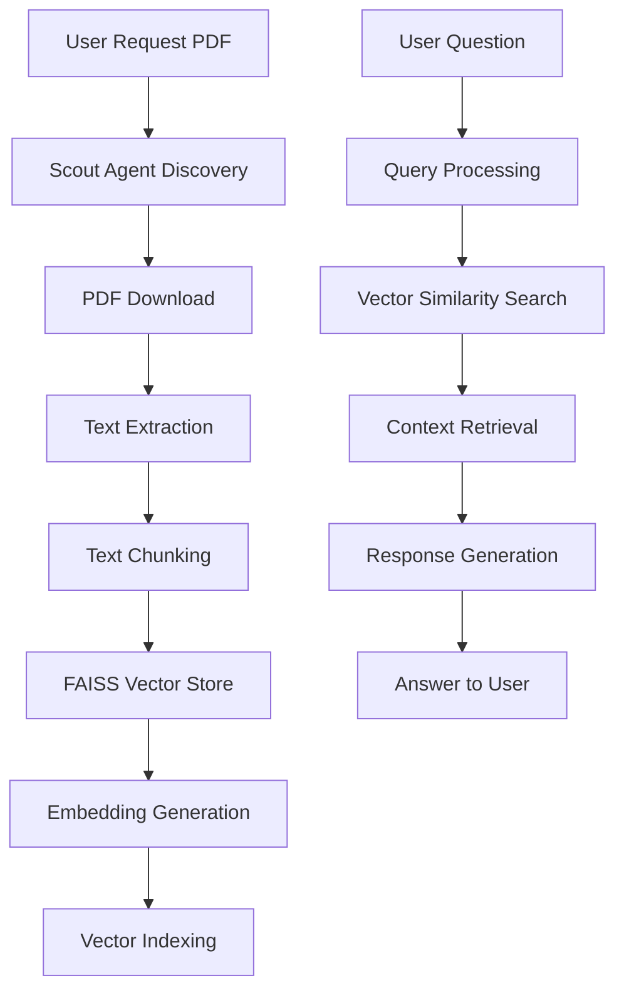

# Scout Agent - LangGraph-based Chatbot

This is a Streamlit-based chatbot application that uses LangGraph for conversation management and memory handling. The application provides an interactive chat interface with user profile management and conversation history tracking.

## Features

- 🤖 Interactive chat interface with memory-enabled conversations
- 👤 User profile management
- 📚 Conversation history tracking
- 🧹 Memory clearing functionality
- 💡 Context-aware responses
- 🔄 Persistent conversation threads

## Technical Implementation

### Core Components

1. **ChatBot Class (agent_langgraph.py)**
   - Implements conversation management using LangGraph
   - Handles memory persistence and retrieval
   - Manages user context and conversation threads

2. **Streamlit Interface (app.py)**
   - Provides the user interface
   - Manages session state
   - Handles user interactions

### Key Features Implementation

#### Conversation Management
- Uses UUID for unique thread identification
- Maintains separate conversation threads for different chat sessions
- Implements memory-enabled conversations for context retention

#### User Context
- Stores user profile information (name, company, email)
- Associates context with specific user IDs
- Persists user preferences across sessions

#### Memory Handling
- Implements conversation history storage
- Provides memory clearing functionality
- Tracks message count for interaction insights

## Usage

1. **Starting the Application**
   ```bash
   cd additional
   streamlit run app.py
   ```

2. **User Profile Setup**
   - Access the sidebar to set your profile information
   - Update profile details as needed
   - Profile information is used to personalize responses

3. **Chat Interaction**
   - Type messages in the input field
   - Click "Send" to interact with the bot
   - View conversation history in the sidebar
   - Clear chat memory when needed

4. **Features**
   - Profile Management: Update user information
   - Memory Management: Clear chat history
   - History Viewing: Access past conversations
   - Quick Tips: Receive periodic interaction suggestions

## Technical Requirements

- Python 3.x
- Streamlit
- LangGraph
- UUID

## Dependencies

```python
streamlit
langgraph
uuid
```

## Architecture

The application follows a modular architecture:

```
additional/
├── app.py              # Streamlit interface
├── agent_langgraph.py  # LangGraph implementation
└── README.md          # Documentation
```

## Document Processing and Q&A Flow

### Document Processing Pipeline



### Process Flow Description

1. **Document Discovery & Download**
   - User requests specific PDF documents
   - Scout Agent searches and discovers relevant PDFs
   - Downloads PDFs to local storage

2. **Text Processing Pipeline**
   - PDF text extraction using PyPDF2 or similar
   - Text chunking for optimal context windows
   - Chunk size optimization for better retrieval

3. **Vector Storage & Indexing**
   - FAISS vector store implementation
   - Efficient similarity search
   - Fast retrieval of relevant context

4. **Question Answering Flow**
   - User submits question
   - Query embedding generation
   - Vector similarity search in FAISS
   - Context retrieval from most relevant chunks
   - Response generation using retrieved context


## Results and Images


### Key Components

1. **Document Processor**
   - PDF downloader
   - Text extractor
   - Chunking engine
   - Vector store manager

2. **FAISS Integration**
   - Vector indexing
   - Similarity search
   - Context retrieval
   - Memory-efficient storage

3. **Q&A System**
   - Query processor
   - Context retriever
   - Response generator
   - Answer formatter

### Benefits

- Efficient document processing
- Reduced context length through chunking
- Fast similarity search with FAISS
- Scalable vector storage
- Improved response accuracy
- Memory-efficient operations

